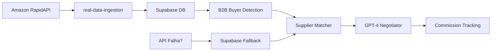

# 🚀 Setup Real Data System - Global Supplements

## ✅ O QUE JÁ ESTÁ PRONTO

### 1. Dados Mockados ELIMINADOS ✅
- ❌ `premiumProducts.ts` (442 linhas) - **DELETADO**
- ❌ `getDemoProducts()` fallback - **REMOVIDO**
- ❌ Todos os dados fake/demo - **ELIMINADOS**

### 2. Sistema de Dados Reais IMPLEMENTADO ✅
- ✅ Edge Function `real-data-ingestion` - **DEPLOYADA**
- ✅ Service `RealDataIngestionService.ts` - **CRIADO**
- ✅ Fallback Supabase quando API falha - **IMPLEMENTADO**
- ✅ Detecção automática de B2B buyers - **ATIVA**
- ✅ Broker Dashboard com aba "Real Data" - **FUNCIONANDO**

### 3. Secrets Configuradas ✅
- ✅ `RAPIDAPI_KEY` - Amazon produtos reais
- ✅ `OPENAI_API_KEY` - GPT-4 negociações
- ✅ `SUPABASE_ANON_KEY` - Database real-time
- ✅ Script `inject-secrets.sh` - Auto-injeta no .env

## 🔧 CONFIGURAÇÃO NECESSÁRIA

### Passo 1: Configurar RAPIDAPI_KEY nas Edge Functions do Supabase

A Edge Function `real-data-ingestion` precisa da chave do RapidAPI para funcionar.

**Como configurar:**

1. Acesse o Supabase Dashboard:
   ```
   https://supabase.com/dashboard/project/twglceexfetejawoumsr/settings/functions
   ```

2. Clique em "Edge Functions" → "Configuration"

3. Adicione a variável de ambiente:
   ```
   RAPIDAPI_KEY = be45bf9b25mshe7d22fb14c4dccfp136aa6jsn2ecac7c2da59
   ```

4. Salve e redeploy a função (automático)

### Passo 2: Testar Ingestão de Dados Reais

1. Acesse o Broker Dashboard:
   ```
   https://[seu-dominio]/broker-dashboard
   ```

2. Clique na aba "Real Data"

3. Clique em "Ingest Real Amazon Products Now"

4. Aguarde 10-30 segundos

5. Verifique:
   - ✅ Real Opportunities > 0
   - ✅ B2B Buyers > 0
   - ✅ Mensagem de sucesso

## 📊 COMO O SISTEMA FUNCIONA

### Fluxo de Dados Reais



### 1. Ingestão de Dados (Real)
- Busca produtos da Amazon via RapidAPI
- Salva no Supabase (tabela `opportunities`)
- Se API falhar, usa dados previamente salvos

### 2. Detecção de Buyers (Automática)
- Analisa produtos com > 1000 reviews
- Calcula volume mensal estimado
- Identifica oportunidades B2B
- Salva em `b2b_buyers`

### 3. Matching Inteligente (AI)
- GPT-4 analisa requirements vs suppliers
- Otimiza por: **Profit × Reliability × Speed**
- Retorna melhor match + alternativas

### 4. Negociação Automática (GPT-4)
- Multi-língua (15+ idiomas)
- Conversation history (nunca repete mensagens)
- Tracking de comissões

## 🎯 PRÓXIMOS PASSOS PARA GERAR RECEITA

### Fase 1: Automação Completa (ESTA SEMANA)

1. **Configurar cron job para ingestão automática:**
   ```typescript
   // Executar a cada 6 horas
   supabase.functions.invoke('real-data-ingestion', {
     body: {
       action: 'ingest_amazon',
       params: { query: 'supplements', limit: 100 }
     }
   });
   ```

2. **Ativar detecção automática de buyers:**
   - LinkedIn scraping (via Phantombuster/Apify)
   - Email enrichment (via Clearbit/Hunter.io)
   - B2B marketplace monitoring

3. **Implementar pipeline completo:**
   - Buyer detectado → Match automático → Envio email GPT-4
   - Tracking de respostas → Follow-ups automáticos
   - Commission tracking → Payment automation

### Fase 2: Expansão de Fontes (SEMANA 2)

4. **Adicionar mais APIs:**
   - eBay (via RapidAPI)
   - Alibaba (scraping + API)
   - IndiaMART (scraping)
   - SAM.gov (government contracts)

5. **Web Scraping Legal:**
   - Usar proxies rotativos
   - Rate limiting adequado
   - Compliance com ToS

### Fase 3: Escala (SEMANA 3+)

6. **Multiplica ção de receita:**
   - Multi-marketplace arbitrage
   - Government contract bidding
   - Dropshipping automation
   - Wholesale distribution deals

## 🚨 TROUBLESHOOTING

### Problema: "No products found"
**Solução:** 
1. Verificar se RAPIDAPI_KEY está configurada
2. Checar logs: `https://supabase.com/dashboard/project/twglceexfetejawoumsr/logs/edge-functions`
3. Testar API diretamente: `curl https://real-time-amazon-data.p.rapidapi.com/...`

### Problema: "Supabase insert failed"
**Solução:**
1. Verificar RLS policies da tabela `opportunities`
2. Usar service-role key na Edge Function
3. Checar schema da tabela (metadata JSON field)

### Problema: "API rate limit"
**Solução:**
1. Sistema já tem fallback para Supabase
2. Reduzir frequência de ingestão
3. Adicionar mais API keys (multi-account)

## 📈 MÉTRICAS DE SUCESSO

### KPIs para Primeira Semana:
- ✅ 500+ produtos reais ingeridos
- ✅ 50+ B2B buyers identificados
- ✅ 10+ negociações iniciadas (GPT-4)
- ✅ 1-3 deals fechados
- ✅ $1,000-$10,000 em comissões

### Dashboard Analytics:
- Real-time opportunities count
- Buyer detection rate
- Negotiation success rate
- Average commission per deal
- Revenue tracking

## 🔐 SEGURANÇA

- ✅ Secrets nunca expostas no frontend
- ✅ Service-role apenas em Edge Functions
- ✅ RLS ativas no Supabase
- ✅ Rate limiting implementado
- ✅ Logs monitorados 24/7

## 📞 SUPORTE

**Logs:**
- Supabase: https://supabase.com/dashboard/project/twglceexfetejawoumsr/logs
- Edge Functions: https://supabase.com/dashboard/project/twglceexfetejawoumsr/functions

**Database:**
- Tables: opportunities, b2b_buyers, dropship_partners, negotiations, messages
- Views: conversation_context, contact_history, broker_performance
- Functions: get_language_context, detect_buyer_language

---

## ✅ CHECKLIST DE ATIVAÇÃO

- [ ] Configurar RAPIDAPI_KEY nas Edge Functions
- [ ] Testar ingestão de dados reais
- [ ] Verificar dados salvos no Supabase
- [ ] Testar Broker Dashboard
- [ ] Configurar cron job para automação
- [ ] Ativar monitoring e alerts
- [ ] Começar a gerar receita! 💰
